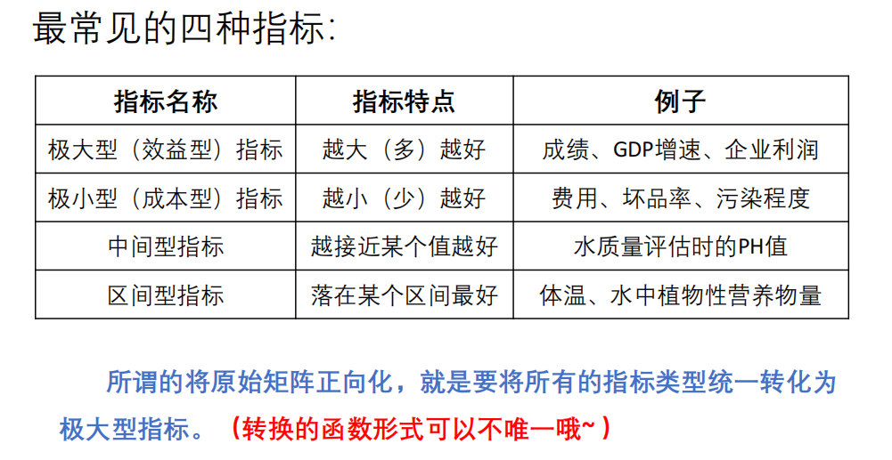
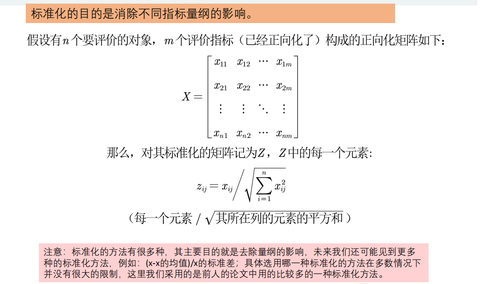
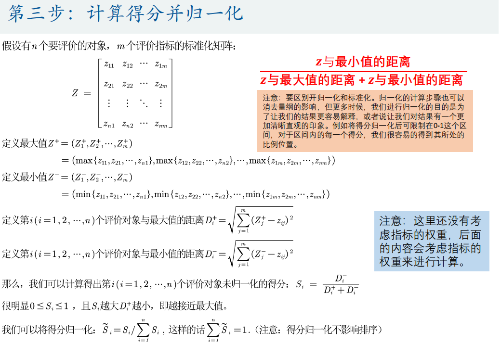
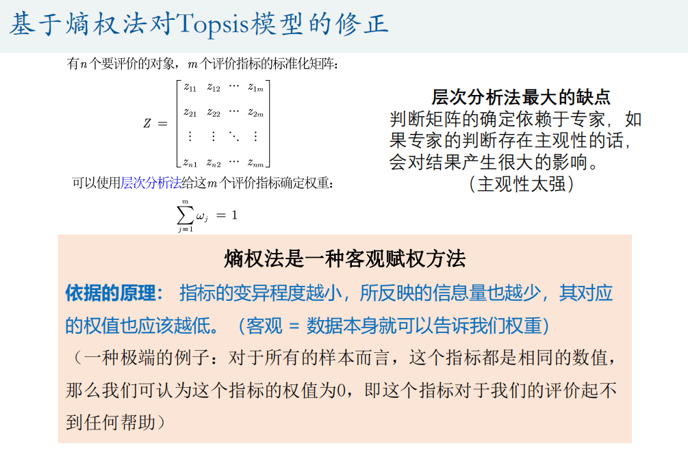
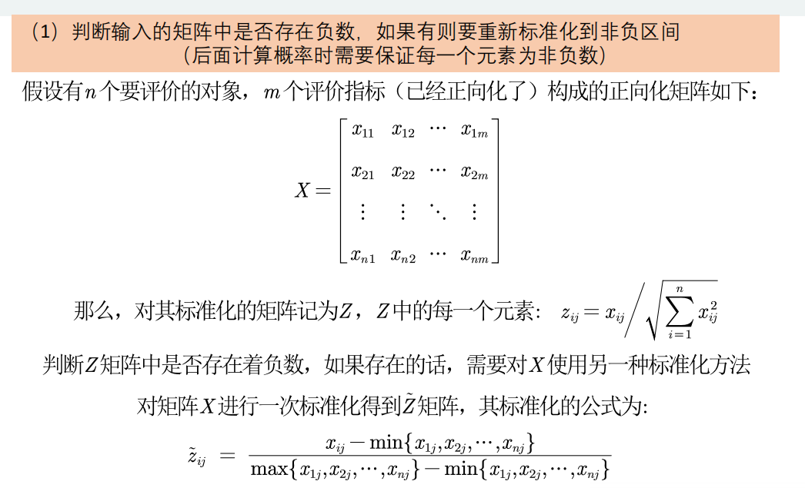
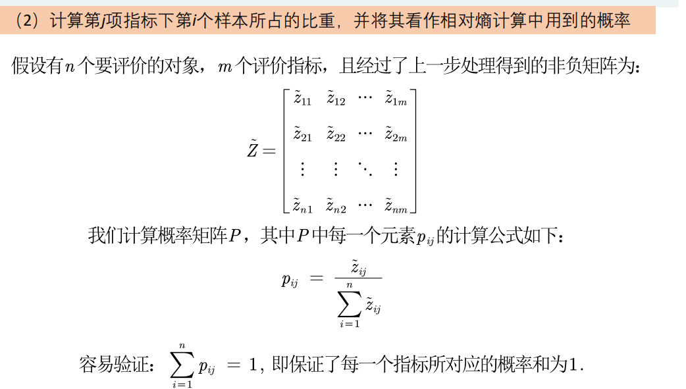
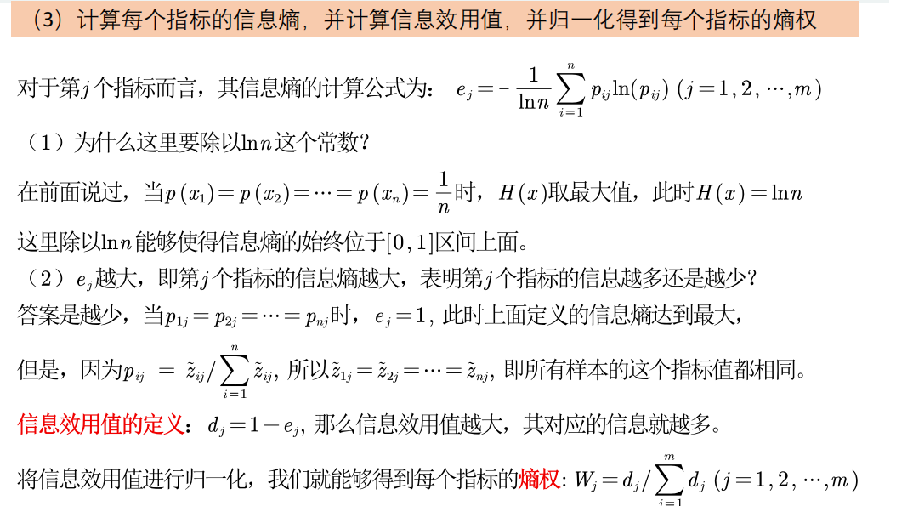

# Topsis方法

C.L.Hwang 和 K.Yoon 于1981年首次提出 TOPSIS (Technique for 
Order Preference by Similarity to an Ideal Solution)，可翻译为逼近理
想解排序法，国内常简称为**优劣解距离法**。
TOPSIS 法是一种常用的综合评价方法，能充分利用原始数据的
信息，其结果能精确地反映各评价方案之间的差距。
基本过程为先将原始数据矩阵统一指标类型**一般正向化处理**
得到正向化的矩阵，再对正向化的矩阵进行标准化处理以消除各指
标量纲的影响，并找到有限方案中的最优方案和最劣方案，然后分
别计算各评价对象与最优方案和最劣方案间的距离，获得各评价对
象与最优方案的相对接近程度，以此作为评价优劣的依据。该方法
对数据分布及样本含量没有严格限制，数据计算简单易行。

## 步骤

### 第一步：将原始矩阵正向化

### 第二步：正向化矩阵标准化

### 第三步：计算得分并归一化

### 熵权法

若不同指标权重不同，需要用到熵权法。

#### 第一步：归一化

#### 第二步：计算比重

#### 第三步：计算熵权

